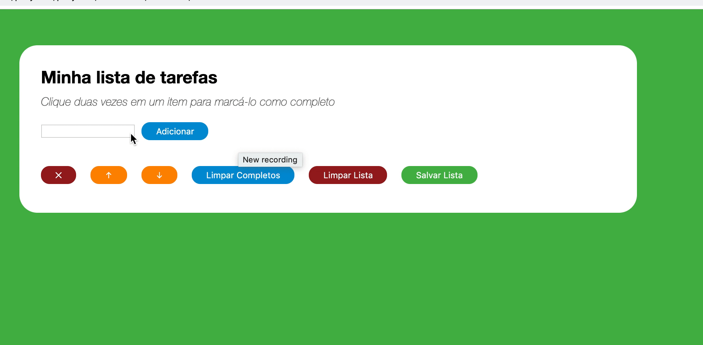

# Welcome to the To Do List Project!

---

### 💡See the following example of what the project might look like after it's done.  

---

## Mandatory Requirements:

### 1 - Your list should have the title "My Task List" in a `header` tag. This title does not vary according to the content of the list.

### 2 - Below the title there should be a small and discreet paragraph with the text "Double click on an item to mark it as complete" explaining how the list works for the user.

### 3 - There must be an `input` where the user can type the name of the item he wants to add to the list.

### 4 - There should be an ordered, tag `ol` list of tasks.

### 5 - There must be a button and when clicking on that button, a new item must be created at the end of the list and the input text must be cleared.

- The addition of elements to the list will be done a few times, and it will be checked if all created items remain in the list as new ones are added.

### 6 - Items in the task list must be ordered in order of creation.

### 7 - When clicking on an item in the list, change the background color of the item to rgb gray (128,128,128).

### 8 - It should not be possible to select more than one element from the list at the same time.

### 9 - When you double-click on an item, it should be crossed out, indicating that it has been completed. It should be possible to undo this action by double-clicking the item again.

- text-decoration property with line-through value.

### 10 - There should be a button that when clicked should delete all items from the list.

- It will be verified that, since a list has tasks, a click on the button leaves it empty

### 11 - There should be a button that when clicked removes **only** the finished elements from your list.

## Bonus

### 12 - Add a button that saves the contents of the list. If you close and reopen the page, the list should continue as it was.

- It will be verified that, when the list has several elements, some of which are marked as finished, a reload of the page keeps the list exactly as it is.

### 13 - Add two buttons to move the selected item up or down in the task list.

- It will be verified that, given that several elements were added to the list, moving them in different ways leaves them in the expected positions
- It will be verified that, if any element is finalized, this status must persist even if the element moves
- It will be verified that, if no element is selected, clicking on the buttons does not change the list
- It will be verified that an element that is selected must remain selected even after being moved
- _Special case!_ It will be verified that, if you try to move the item to the top of the list or, if you try to move the last item to the list, it should not be changed

### 14 - Add a button that when clicked removes the selected item.

---

#VQV 🚀
