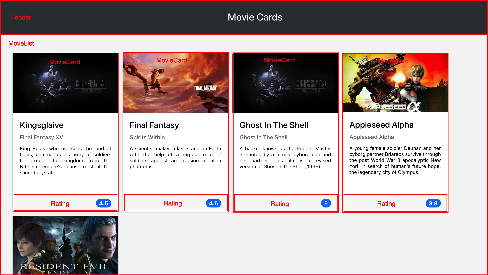

# Welcome to the Movie Cards Library project repository!

---

You should develop a movie card library using React. The library must have a header and a list of cards. Each card represents a film and has an image, title, subtitle, synopsis and evaluation. The library should look something like the image below.  

Each component represents a specific part of the website, as shown below:

---

## Project requirements

#### 1 Create a component called `Header`

#### 2 Render the text "Movie Cards Library" inside `Header`

#### 3 Create a component called `MovieList`

`MovieList` should receive a prop` movies`, which is an array of objects with information from a movie.

#### 4 Render `MovieCard` components within `MovieList`

`MovieList` must render a` MovieCard` component for each object contained in the array received in the `movies` prop.

#### 5 Pass a key to each rendered `MovieCard`

#### 6 Create a component called `MovieCard`

`MovieCard` should receive a `movie` prop. This prop will be an object, containing the properties, `title`, `subtitle`, `storyline`, `imagePath` and `rating`.

#### 7 Render the movie image

#### 8 Render the movie title

#### 9 Render the movie subtitle

#### 10 Render the move storyline

#### 11 Render a `Rating` component inside a` MovieCard`

#### 12 Pass the rating attribute as a prop for the `Rating` component

#### 13 Create a component called `Rating`

#### 14 Render a movie note within Rating

#### 15 `App` should render` Header`

#### 16 `App` should render `MovieList`

#### 17 - Add proptypes to all components

---

#VQV
